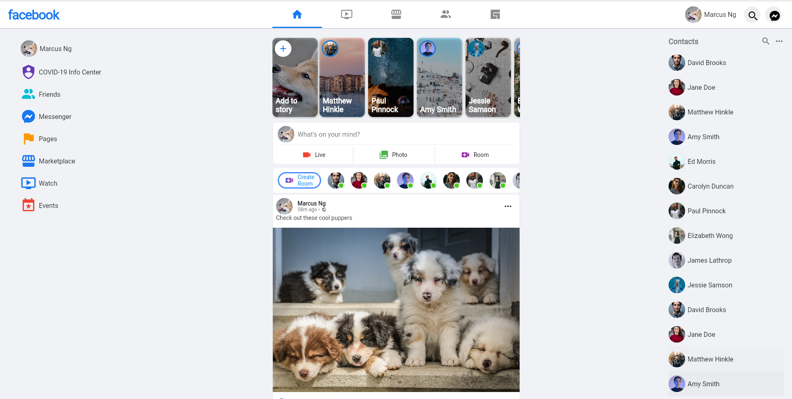
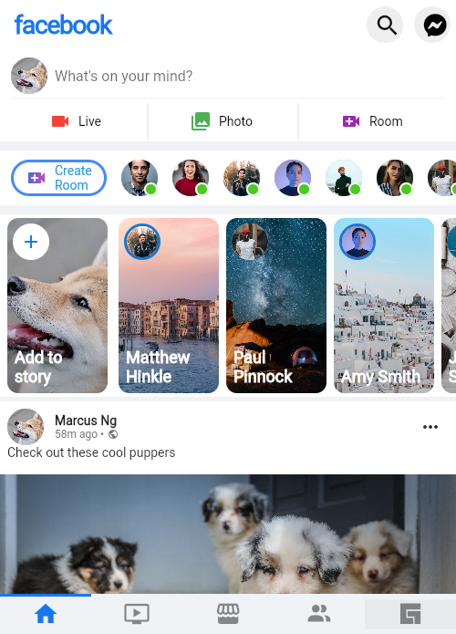

# Facebook UI

## Practice UI clone


## Showcase

<table>
  <tr>
    <td>Desktop</td>
  </tr>
  <tr>
  <td>    </td>
  </tr>

  
  <tr>
    <td>Desktop zoomed</td>
  </tr>
  <tr>
    <td></td>
  </tr>

  <tr>
    <td>Home Mobile</td>
  </tr>
  <tr>
    <td></td>
  </tr>

 </table>
<br/>

## Stacks

- Dart
- Flutter

<br/>

## Topics

1. [MaterialApp]()
2. [Scaffold]()
3. [AppBar]()
4. [DefaultTabController]()
5. [PreferredSize]()
6. [IndexedStack]()
7. [TrackingScrollController]()
8. [CustomScrollView]()
9. [SystemUiOverlayStyle]()
10. [SliverAppBar]()
11. [SliverToBoxAdapter]()
12. [SliverPadding]()
13. [SliverList]()
14. [Flexible]()
15. [Spacer]()
16. [BoxDecoration]()
17. [BoxConstraints]()
18. [ListView.builder()]()
19. [ClipRRect]()
20. [Card]()
21. [Column]()
22. [Row]()
23. [SizedBox]()
24. [Expanded]()
25. [TextField]()
26. [InputDecoration.collapsed()]()
27. [Divider]()
28. [ElevatedButton.icon()]()
29. [VerticalDivider]()
30. [TabBar]()
31. [Tooltip]()
32. [InkWell]()
33. [IconButton]()
34. [Icon]()
35. [Stack]()
36. [Positioned]()
37. [CircleAvatar]()
38. [LayoutBuilder]()
39. [OutlinedButton]()
40. [ButtonStyle]()
<br/>

#### Packages

```
1. MdiIcons
2. CachedNetworkImage
3.
```